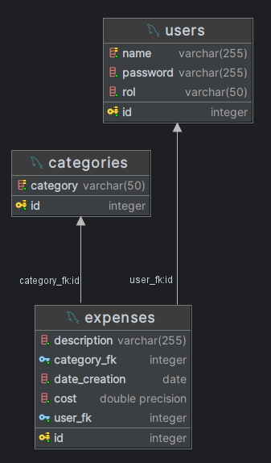
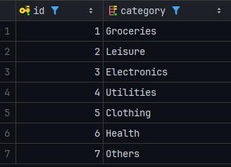

# Expense tracker API

API for an expense tracker. Project of [roadmap.sh](https://roadmap.sh)

- Create, read, update and delete expenses.
- Authentication of users to use the API

## Requirements

- Java 17 or higher
- Maven
- PostgreSQL 16.3

## Technologies

- Spring Boot
- JDBC Client
- Spring Boot Validation
- Spring Boot Tomcat
- Spring Security
- JWT

## API

<iframe src="https://redocly.github.io/redoc/?url=ExpenseTracker-openapi.yaml" width="100%" height="800px">
</iframe>

###### Generated with OpenAPI Specifications version 242.24807.4 in IntelliJ IDEA  

## Structure of Database

#### Database is generated with the [Script sql](src/main/resources/schema.sql) when the application starts.

###### Generated with IntelliJ IDEA

### Table: Categories

