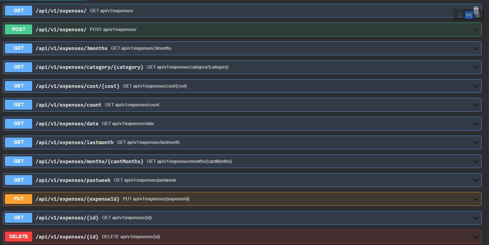
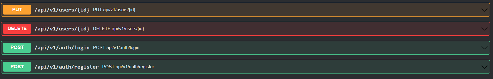
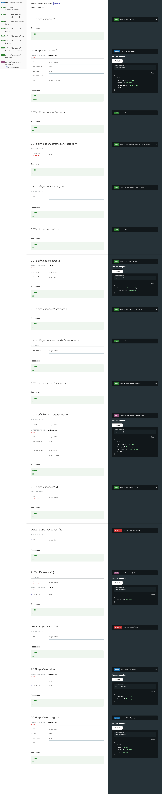

# Expense Tracker API

API for an expense tracker. This is a solution of [Expense Tracker API](https://roadmap.sh/projects/expense-tracker-api) project [roadmap.sh](https://roadmap.sh). 

- Create, read, update and delete expenses.
- Authentication of users to use the API

## Requirements

- Java 17 or higher
- Maven
- PostgreSQL 16.3

## Technologies

- Spring Boot
- JDBC Client
- Spring Boot Validation
- Spring Boot Tomcat
- Spring Security
- JWT

## API

###### Generated with OpenAPI Specifications version 242.24807.4 in IntelliJ IDEA  

 View extensive documentation

###### View of [ExpenseTracker-openapi](ExpenseTracker-openapi.yaml) by Redocly.

> [!IMPORTANT]
> When a user is created, their rol always is Client.
> User only can be Admin or Client. 

## Structure of Database

#### Database is generated with the [Script sql](src/main/resources/schema.sql) when the application starts.

###### Generated with IntelliJ IDEA

### Table: Categories

When you start the application if the table is missing data, the data is added automatically.

> [!Note]
> To use the application, fill in the data in the .env file.

